# Proiect Baza de Date - README

## 1. Descrierea pe scurt a activitatii pentru care se realizeaza proiectul

Proiectul constă în dezvoltarea unui sistem de gestionare a informațiilor medicale, în care pacienții pot programa întâlniri cu medici. Aplicația va permite și gestionarea informațiilor despre pacienți, medici și programări.

## 2. Identificarea dependentelor functionale si aducerea schemei bazei de date cel putin in forma normala BCNF utilizand normalizarea 

Pentru identificarea dependențelor funcționale și aducerea schemei în forma normală BCNF, s-au efectuat analize detaliate și normalizări corespunzătoare. Aceasta asigură o structură optimă a bazei de date.

## 3. Crearea diagramei entitate-relatie (ERD) sau diagramei de tabele corespunzatoare datelor

Am realizat o diagramă entitate-relație (ERD) pentru a vizualiza relațiile dintre diferitele entități din sistem.
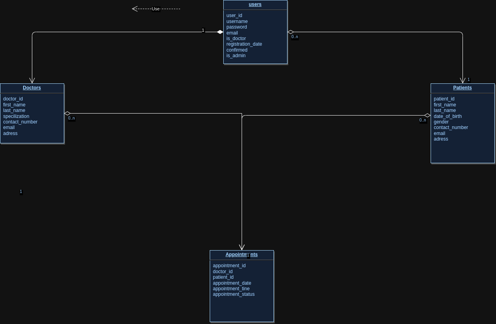

## 4. Definirea tabelelor

### Tabele:

- Tabela `Patients`:

  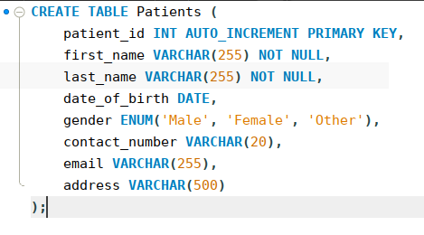

- Tabela `Doctors`:

  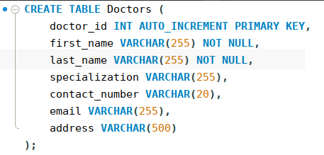

- Tabela `Appointments`:

  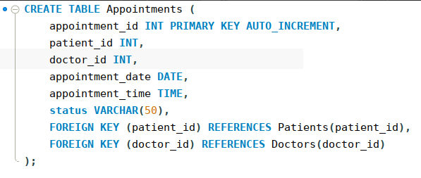

- Tabela `Users`:

  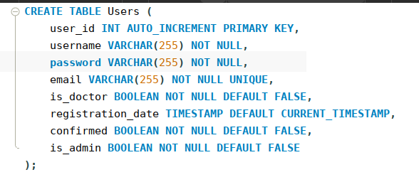

## 5. Confirmarea existentei tabelelor create prin interogarea vederilor din dictionarul datelor; vizualizarea structurii acestora si a constrangerilor aferente

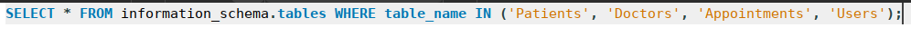
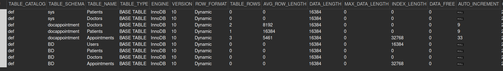

## 6. Definirea de obiecte ale bazei de date, altele decat tabele: vederi, indecsi; confirmarea existentei obiectelor in dictionarul datelor
### Am creat o vedere pentru a afișa programările viitoare ale pacienților, împreună cu detalii despre aceștia și medicii care îi vor consulta.
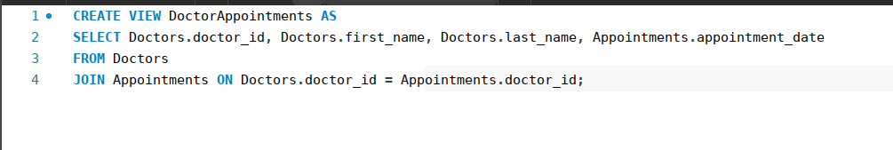
### Am verificat existența vederii în dictionarul de date.
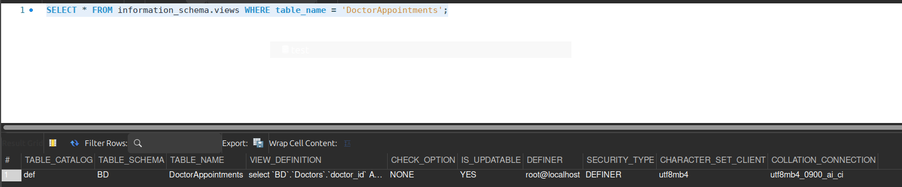
### Am creat un index pentru a accelera căutarea programărilor după data acestora.
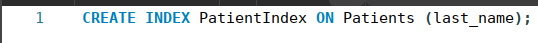
### Am verificat existența indexului în dictionarul de date.
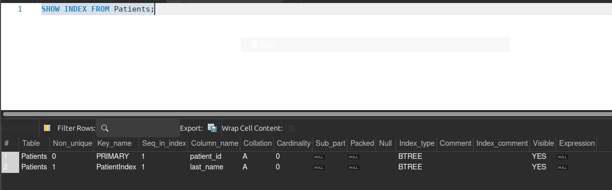

## 7. Exemplificare de comenzi de prelucrare asupra datelor: adaugare, modificare, stergere, selectie
### Am adăugat date în tabelele `Patients`, `Doctors`, `Users`, `Appointments`
#### Adăugare date în tabela `Patients`
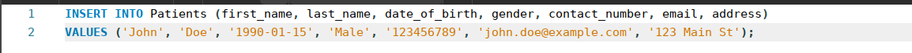
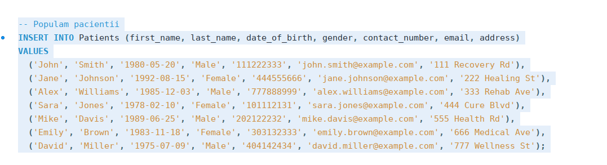
#### Adăugare date în tabela `Users`
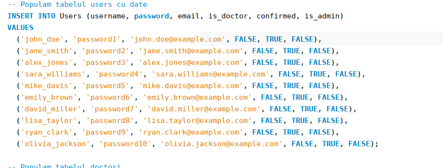
#### Adăugare date în tabela `Doctors`
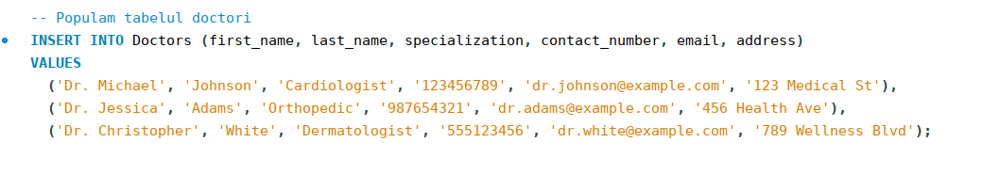
#### Adăugare date în tabela `Appointments`
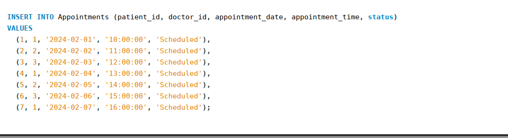

### Modificare date în tabela `Doctors`

### Ștergere date din tabela `Appointments`

## 8. Selectia datelor - minim 5 interogari complexe ce pot fi incluse si in definitia unor viewuri, care contin conditii/clauze complexe.

1. **Vedere pentru programari viitoare cu detalii despre pacienti si medici:**
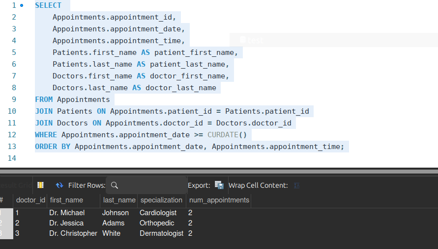

2. **Vedere pentru numarul total de programari pentru fiecare medic:**
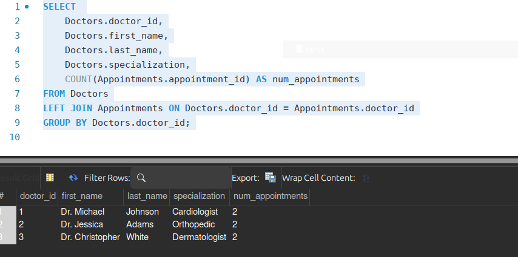

3. **Vedere pentru programarile doctorilor într-o zi specifică:**
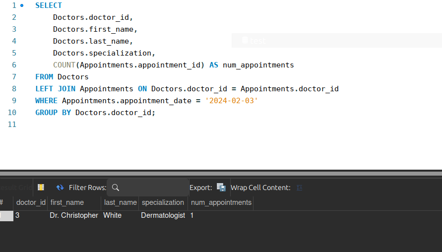

4. **Interogare pentru a afla pacientii care au programari pe mai multe date:**
 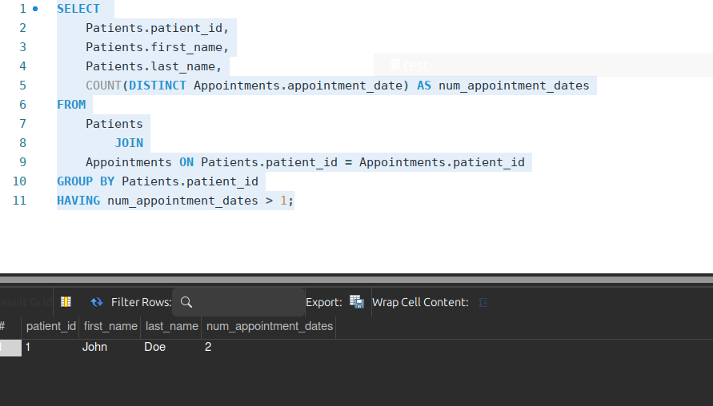

5. **Interogare complexa pentru a obtine detalii despre programarile unui medic specific:**
 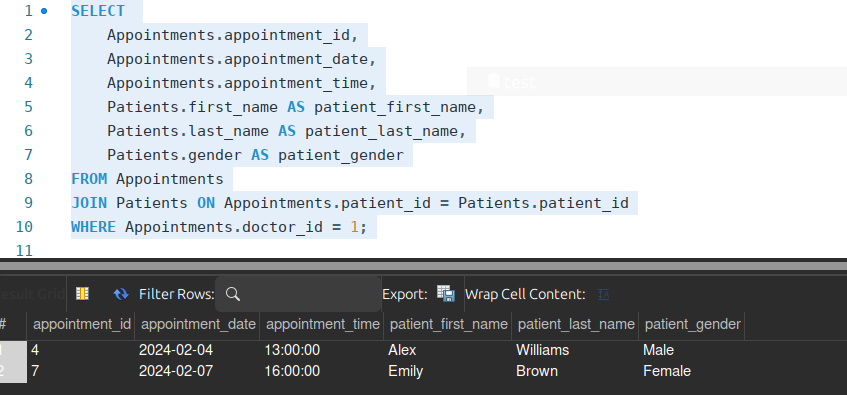
